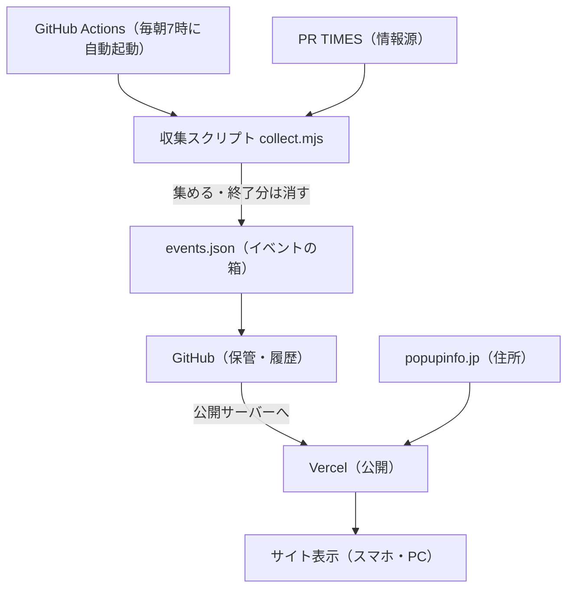

# popupinfo プロジェクト概要（まとめ）

> 最終更新: 2026-07-08
> このドキュメントは、初心者にも分かるように「何を・どこで・どう動かしているか」をまとめたものです。

---

## 1. これは何のアプリ？

**全国のコスメ・日用品の「無料サンプルがもらえる」イベント／ポップアップ**を、
毎日自動で集めて、**現在地から近い順・エリア・キーワード**で探せる Web アプリです。

- 公開URL（現在）: https://popupinfo.vercel.app
- 独自ドメイン（設定中）: https://popupinfo.jp
- GitHub: https://github.com/kan-na00/popupinfo

> 補足: 姉妹アプリとして「コスメ ポップアップ レーダー」（東京・神奈川に特化 / https://cosme-popup-radar.vercel.app ）もありますが、本書は **popupinfo** についてのまとめです。

---

## 2. 登場人物（場所）とその役割

身近なものへのたとえ：

| 名前 | 役割（たとえ） |
| --- | --- |
| 自分のMac（ローカル） | 作業机。コードを書く「下書き場所」 |
| 収集スクリプト（`scripts/collect.mjs`） | 情報を集めてくる**ロボット**。PR TIMESを見て回る |
| `data/events.json` | 集めたイベントを入れる**箱（データ）** |
| GitHub | コードの**金庫＋履歴（タイムマシン）**。バックアップと変更記録 |
| Vercel | サイトを世界に出す**お店（公開サーバー）** |
| ドメイン（popupinfo.jp） | お店の**住所（覚えやすい名前）** |
| GitHub Actions | **毎朝7時に動く自動タイマー**。ロボットを自動で起動する |

---

## 3. 動きの流れ



1. **集める**: ロボットがPR TIMESを見て、コスメ・日用品の無料サンプル情報を取得 → 箱に入れる。**終了したイベントはこのとき自動削除**。
2. **しまう**: 箱をGitHub（金庫）に保存。履歴も残る。
3. **出す**: Vercel（お店）が箱を読んでサイトとして公開。
4. **見る**: URL（やドメイン）でアクセスして閲覧。

---

## 4. 技術スタック

### 言語
| 言語 | 用途 |
| --- | --- |
| TypeScript | アプリ本体（画面・部品・ロジック） |
| JavaScript | 収集スクリプト（`collect.mjs`） |
| CSS | 見た目・デザイン（ヘッダー、カード、背景のキラキラ） |
| JSON | データ（`events.json`）・設定 |
| YAML | 毎日自動実行の設定（GitHub Actions） |

### フレームワーク・ライブラリ
| 名前 | バージョン | 役割 |
| --- | --- | --- |
| Next.js | 14.2.5 | 土台のフレームワーク（Reactベース。画面＋サーバー機能） |
| React | 18.3.1 | 画面の部品づくり（UI） |
| @vercel/analytics | 1.3.1 | 表示回数の計測（Cookieなし） |
| cheerio | 1.0.0 | 収集時にHTMLを解析する道具 |
| TypeScript | 5.5.3 | 型チェック（開発時） |
| Node.js | 実行環境 | 収集スクリプト・サーバーを動かす土台 |

### サーバー・ホスティング
- **Vercel**（サーバーレス）でNext.jsを公開。自前サーバーは持たない。
- ページは `force-dynamic` = アクセスごとにサーバー側で最新の `events.json` を読んで表示。

### データの持ち方（※データベースは未使用）
- `data/events.json` という1つのファイルに保存（シンプル構成）。
- **お気に入り**は各ユーザーの**ブラウザ内（localStorage）**に保存。サーバーには送らない。

### API・外部サービス
| 種類 | 使っているもの | 補足 |
| --- | --- | --- |
| 情報源 | PR TIMES | 公式APIではなくWebページを解析（スクレイピング） |
| 位置情報 | ブラウザの Geolocation API | 「近い順」用。端末内だけで使い**保存しない** |
| 地図座標 | 内蔵の都道府県座標テーブル | 外部の地図API（有料）は不使用。47都道府県座標で概算 |
| 有料API | なし | 完全無料の範囲で運用 |

---

## 5. 設計の決定事項（壁打ちで決めたルール）

| 項目 | 決定 |
| --- | --- |
| 1件の単位 | イベント／ポップアップ（会場＋期間、終了で消える） |
| ジャンル | コスメ＋日用品に限定 |
| エリア | 全国（都道府県判定＋代表座標で「近い順」） |
| 位置情報オフ時 | エリア絞り or 既定順（東京→神奈川→大阪…） |
| 重複判定 | 会場＋開催期間が同じならほぼ同じ |
| 更新方式 | 差分更新（足す・更新・終了分だけ消す。初掲載日を保持） |
| 信頼性 | 無料サンプルが明確なものを優先、曖昧は「要確認」表示 |
| 計測 | まず表示回数のみ |
| 位置情報 | 端末内のみで使用・保存しない |
| 速度対策 | 一覧は「もっと見る」で区切って表示 |
| 再訪導線 | 端末内お気に入り＋今週の新着 |
| 異常検知 | 収集0件ならジョブ失敗→GitHubから通知 |
| コスト | 完全無料の範囲（有料API・DBなし） |

---

## 6. 主なファイル構成

```
popupinfo/
├── app/
│   ├── layout.tsx          画面の外枠（＋表示回数の計測）
│   ├── page.tsx            トップページ（データ読み込み）
│   ├── globals.css         デザイン（ヘッダー・カード・キラキラ）
│   └── privacy/page.tsx    プライバシーポリシー
├── components/
│   ├── EventBoard.tsx      一覧・検索・フィルタ・近い順・お気に入り
│   └── Sparkles.tsx        背景のキラキラ（canvasアニメ）
├── lib/
│   ├── types.ts            データの型
│   ├── geo.ts              都道府県の座標・距離計算
│   └── events.ts           データ読み込み
├── data/
│   └── events.json         イベントデータ（自動更新される）
├── scripts/
│   └── collect.mjs         収集スクリプト（PR TIMESアダプタ）
├── .github/workflows/
│   └── daily-collect.yml   毎日自動収集の設定
├── README.md
└── OVERVIEW.md（このファイル）
```

---

## 7. 現在の状況（2026-07-08 時点）

| 項目 | 状態 |
| --- | --- |
| Vercel公開 | ✅ https://popupinfo.vercel.app |
| GitHub | ✅ https://github.com/kan-na00/popupinfo |
| 独自ドメイン popupinfo.jp | 🔧 設定中（ネームサーバーをVercelに変更済み・反映待ち） |
| GitHub上データの毎日更新 | ✅ 自動（GitHub Actions・毎朝7時） |
| 公開サイトへの毎日反映 | ⚠️ 現在は**手動**（`vercel --prod` を実行して更新） |

### 「手動」と「自動」の違い（重要）
- **GitHubのデータ**は毎朝自動で最新になる。
- ただし**公開サイト（Vercel）への反映は今は手動**。
  → 完全自動にするには「GitHub Actions から Vercel へ自動デプロイ」を追加すればよい（Vercelトークンを1つ登録）。

---

## 8. 操作方法（手順）

### ローカルで動かす（開発・確認）
```bash
npm install
npm run dev      # http://localhost:3000
```

### 情報を収集する（終了分の削除も自動）
```bash
npm run collect  # data/events.json を更新
```

### 公開サイトを最新にする（手動デプロイ）
```bash
npm run collect      # 最新データを収集
npx vercel --prod    # 公開サイトへ反映
```

---

## 9. 今後の候補

- 公開サイトの**毎日自動更新**（GitHub Actions → Vercel 自動デプロイ）
- **独自ドメイン**の反映完了（popupinfo.jp）
- 収集元の追加（件数アップ）／抽出精度の改善
- 広告の導入（将来の収益化）

---

## 10. 注意事項

掲載情報は自動収集・要約のため、実際と異なる場合があります。
お出かけ前に必ず公式情報（各カードの「詳細・公式情報を見る」リンク）をご確認ください。
